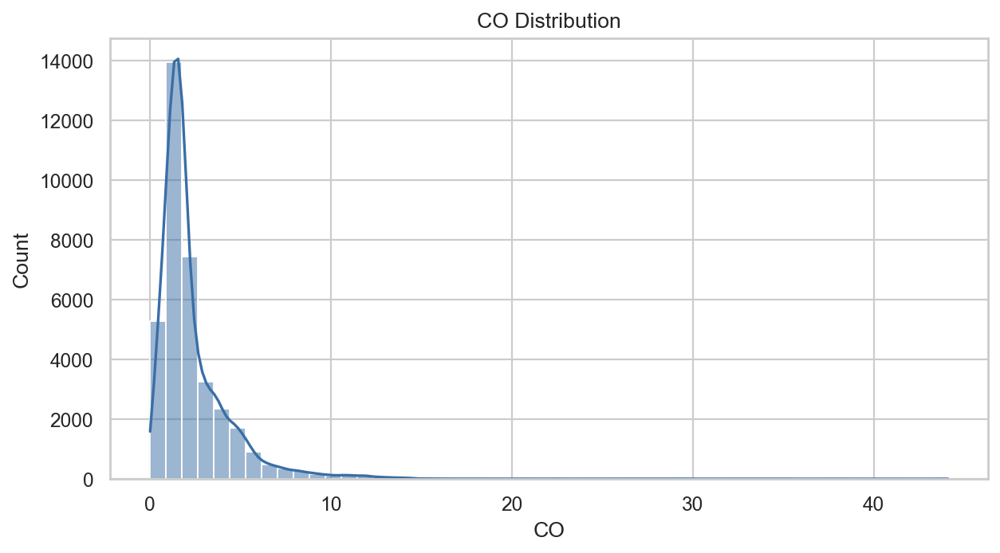
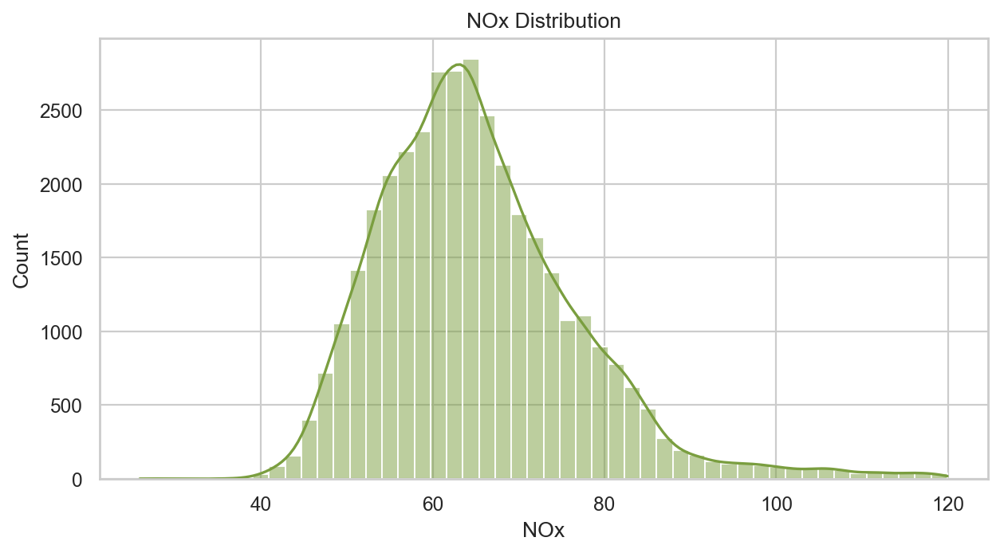
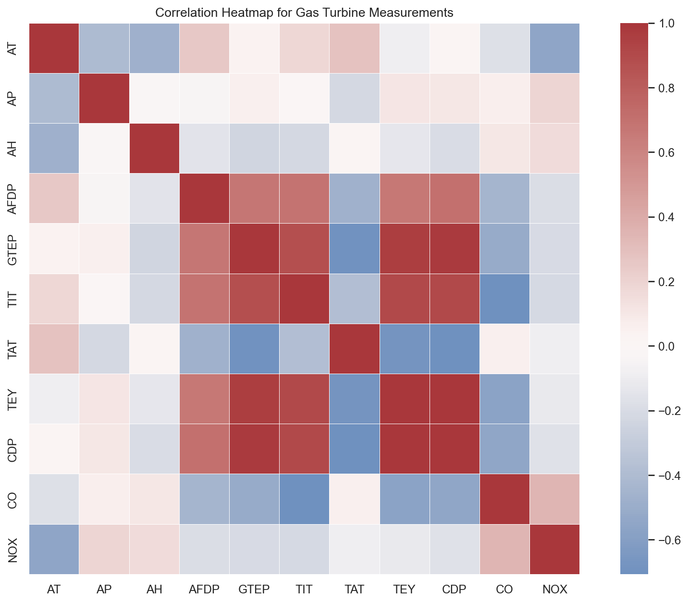
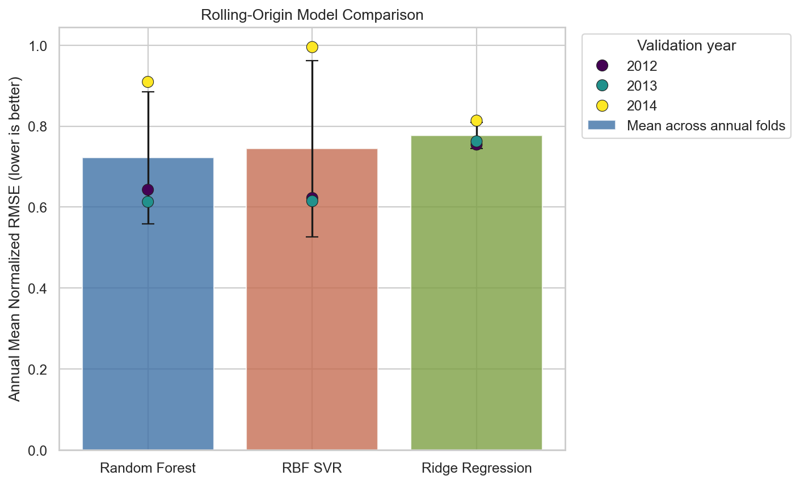
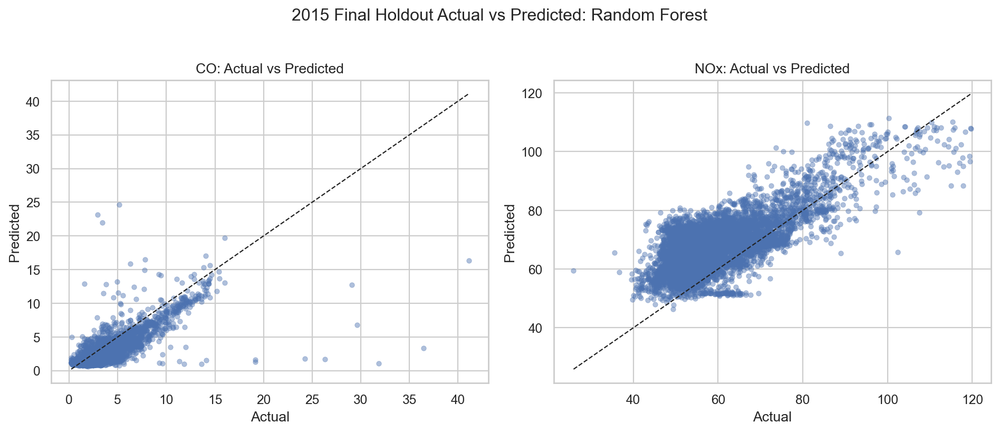

# Gas Turbine CO and NOx Emissions Modeling

This project analyzes the UCI Gas Turbine CO and NOx Emission Data Set with a reproducible machine learning workflow. The notebook predicts carbon monoxide (`CO`) and nitrogen oxides (`NOX`) emissions from gas turbine operating and ambient sensor measurements, then compares model performance using a chronological train, validation, and final holdout split.

The finished analysis is in [`notebooks/01_emissions_modeling.ipynb`](notebooks/01_emissions_modeling.ipynb).

## Dataset

Source: [UCI Machine Learning Repository, dataset id 551](https://archive.ics.uci.edu/dataset/551/gas+turbine+co+and+nox+emission+data+set)

Citation:

> Gas Turbine CO and NOx Emission Data Set [Dataset]. (2019). UCI Machine Learning Repository. https://doi.org/10.24432/C5WC95

The dataset contains hourly aggregated gas turbine sensor measurements from Turkey's north western region. The analysis uses operating and ambient measurements as predictors and treats `CO` and `NOX` as regression targets.

## Problem Framing

The primary task is supervised regression: estimate `CO` and NOx emissions from turbine conditions such as ambient temperature, pressure, humidity, turbine inlet temperature, turbine energy yield, compressor discharge pressure, and related operating variables.

This is an educational ML analysis, not a production emissions monitoring or compliance system. No regulatory compliance claims are made.

## Project Structure

```text
.
├── README.md
├── requirements.txt
├── data/
│   └── .gitkeep
├── images/
│   ├── actual_vs_predicted_best_model.png
│   ├── co_distribution.png
│   ├── correlation_heatmap.png
│   ├── model_comparison.png
│   └── nox_distribution.png
├── notebooks/
│   └── 01_emissions_modeling.ipynb
└── src/
    └── emissions_ml/
        ├── __init__.py
        └── data.py
```

Raw CSV files are intentionally not committed. The notebook fetches the dataset through `ucimlrepo` via `src/emissions_ml/data.py`; if running offline, place an equivalent raw file at `data/raw/gas_turbine_emissions.csv`.

## Modeling Approach

The notebook compares three regression approaches:

- `StandardScaler` + `Ridge(alpha=1.0)` as a stable linear baseline.
- `RandomForestRegressor` as a nonlinear tree-based model.
- `StandardScaler` + RBF `SVR`, wrapped for multi-output regression.

The split is chronological:

| Period | Years | Purpose |
|---|---:|---|
| Train | 2011-2013 | Fit model parameters and preprocessing |
| Validation | 2014 | Compare models and select the best average RMSE |
| Final holdout | 2015 | Evaluate the selected model once |

This avoids selecting the model directly on the final test year.

## Key Results

Best model by 2014 validation average RMSE: **Ridge Regression**.

2015 final holdout performance:

| Target | R2 | RMSE | MAE |
|---|---:|---:|---:|
| CO | 0.0255 | 2.206 | 1.689 |
| NOx | -0.1338 | 11.853 | 10.174 |

The validation results were target-dependent: Random Forest performed best for CO validation RMSE, while Ridge Regression performed best for NOx and won on average validation RMSE. Final holdout performance was weaker than validation, especially for NOx, which suggests year-to-year distribution shift and limits to what the available sensor columns capture.

## Optional Classification Experiment

The notebook also includes an exploratory binary classification exercise for `CO` using the 2011-2013 training median as the threshold.

Threshold: **CO = 1.5242**.

| Period | Accuracy | Balanced Accuracy |
|---|---:|---:|
| 2014 validation | 0.7798 | 0.7850 |
| 2015 final holdout | 0.6410 | 0.7610 |

This threshold is experimental and data-derived. It is not a regulatory threshold.

## Visuals

### CO Distribution



### NOx Distribution



### Correlation Heatmap



### Model Comparison



### Actual vs Predicted



## How To Reproduce

```bash
python -m venv .venv
source .venv/bin/activate
python -m pip install --upgrade pip
python -m pip install -r requirements.txt
jupyter nbconvert --to notebook --execute notebooks/01_emissions_modeling.ipynb --inplace
```

The notebook should be run from the repository root so imports from `src/` resolve correctly.

## Limitations And Next Steps

- Ridge Regression won on average validation RMSE, but it did not generalize strongly to the 2015 final holdout period.
- Random Forest performed best for CO validation RMSE, but not for NOx.
- NOx final holdout performance was weaker than CO, with negative R2 on 2015.
- The current validation design is more honest than a random split, but a stronger next step would be rolling-origin validation across years.
- Feature engineering could explore lagged operating context, operating regimes, interactions, and target transformations.
- The optional CO classifier is only a modeling exercise; the threshold is based on the training median and has no compliance meaning.
